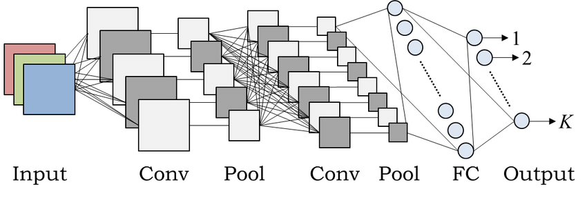

<h1 align="center">
  <a href="https://github.com/pi2-fga/201901-InspecaoCaboDeAco-MainServer" target="_blank">
    
  </a>
</h1>

<p align="center">
  Este projeto é referente à Rede Neural do projeto Inspeção de Cabo de Aço da disciplina de PI2, desenvolvido em:<br>
  <strong>Python, Fastai e JupyterLab.</strong>
</p>

<p align="center">
  <a href="https://www.python.org/downloads/release/python-367/">
    
  </a>
  <a href="https://www.fast.ai/">
    
  </a>
  <a href="https://jupyterlab.readthedocs.io/en/stable/getting_started/installation.html">
    
  </a>
  </a>
</p>

## 📋 Requisitos

Para rodar o projeto é necessário ter o Git, Python 3.6.7, fastai, Jupyter e algumas dependências para manipulação de dados, como NumPy e Pandas.

## 💻 Rodando a aplicação

O primeiro passo é clonar o projeto e em seguida entrar em sua raiz:

```sh
git clone git@github.com:pi2-inspecao-cabo-de-aco/neural-network.git && cd neural-network
```

Ao entrar na pasta, basta utilizar o comando `jupyter lab` ou `jupyter notebook` para ter acesso aos _notebooks_ criados.

## 📂 Estrutura

```
neural-network/
├── challenges/
│   └── ...
├── pre_processing/
│   ├── classification_to_image_name.ipynb
│   └── ...
└── v1/
    ├── fastai_resnet34.ipynb
    └── ...
```
**challenges:** Contém os dados que a equipe classificou no _software_ de rotulação. Existem fotos e csvs que correspondem aos arquivos presentes nos _datasets_ de treinamento.

**pre_processing:** Contém os _notebooks_ com os _scripts_ criados para pré processar os dados rotulados. Eles preparam as entradas a serem utilizadas na Rede Neural.

**v1:** Contém o _notebook_ com a primeira versão da Rede Neural desenvolvida.

## ⚙ Arquitetura

A arquitetura de rede neural escolhida é uma das mais comuns no _Deep Learning_, que é a Rede Neural Convolucional (CNN). Elas podem ser usadas, tanto para agrupar fotos por semelhança, quanto para reconhecer padrões dentro de uma cena específica, no contexto de imagens. Essa rede neural enxerga imagens como volumes (objetos tridimensionais semelhantes a uma caixa retangular, onde o tamanho da imagem em pixels representa a altura e largura da caixa, tendo 3 camadas profundas, representando cada letra do RGB), e não de forma plana, como os humanos. [[Deep Learning Book](http://deeplearningbook.com.br/)] Ao inserir uma imagem na rede a mesma é dividida em extratos de cores empilhadas, como dito anteriormente, e transformada em três matrizes, onde cada pixel tem seu respectivo número na matriz, que representa uma tonalidade de cor em determinada escala, do R, G ou B. Um diferencial da CNN é que ela é capaz de processar a imagem recebida e analisar vários aspectos da imagem de forma separada. [[Deep Learning Book](http://deeplearningbook.com.br/)]

A primeira camada oculta é formada por vários neurônios ocultos, onde eles são conectados a um pequeno grupo de pixels da imagem inserida, e não na imagem inteira. O neurônio oculto se conecta com todo esse grupo de pixels (que é chamado de campo receptivo local), sendo que toda ligação tem um peso e cada neurônios aprendes um _bias_. Após isso, esse campo receptivo é deslocado, e ligado a outro neurônio oculto, e esses “deslocamentos” e ligações formam esta primeira camada oculta. Cada neurônio de determinada camada compartilha dos mesmos pesos e bias e detectam o mesmo recurso da imagem (mapa de recursos), onde uma camada convolucional é formada por vários desses mapas. [[Deep Learning Book](http://deeplearningbook.com.br/)]

Dentro de uma CNN também há camadas de _Pooling_, que vem após as camadas convolucionais e recebe suas saídas, servindo para simplificar as informações que vem dessas camadas, onde é possível condensar informações e ampliar a região de ativação dessa informação. [[Deep Learning Book](http://deeplearningbook.com.br/)]

Também é comum encontrar na arquitetura de uma CNN, camadas no fim da rede camadas _Fully Connected_, onde as informações compiladas são transformadas em um vetor de apenas uma dimensão, gerando otimização na geração dos _outputs_ e classificações. [[Towards Data Science](https://towardsdatascience.com/applied-deep-learning-part-4-convolutional-neural-networks-584bc134c1e2)]

<h1 align="center">
  
</h1>
<h4 align="center">
  Arquitetura de uma CNN [<a href="https://www.researchgate.net/publication/320748406_Consecutive_Dimensionality_Reduction_by_Canonical_Correlation_Analysis_for_Visualization_of_Convolutional_Neural_Networks">Takio Kurita</a>]
</h4>

### Resnet 34